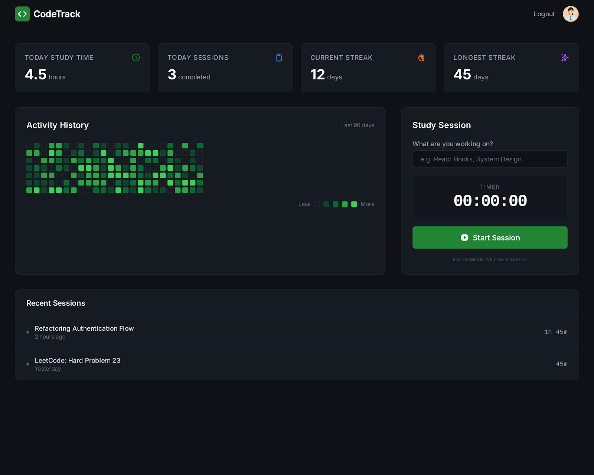
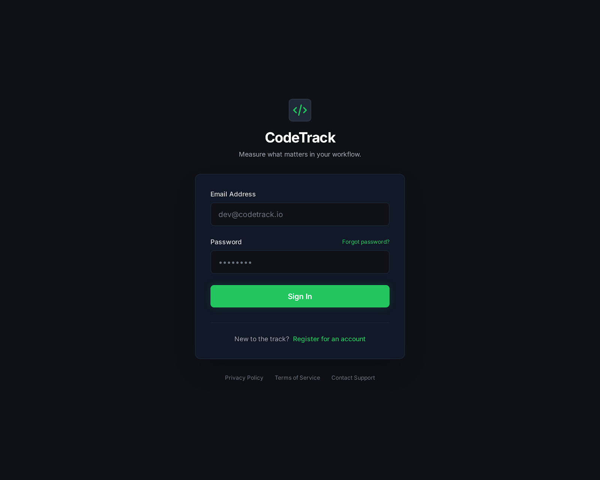
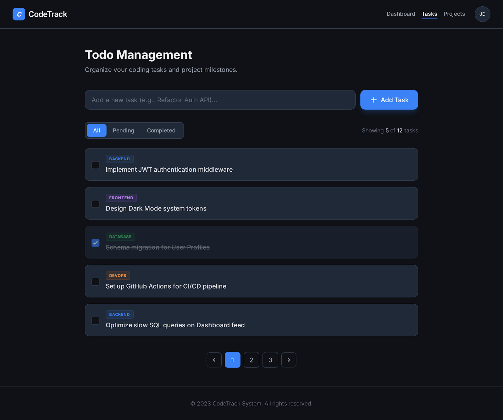
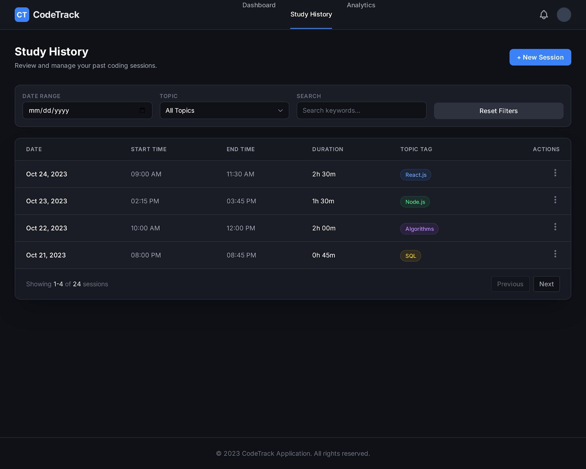
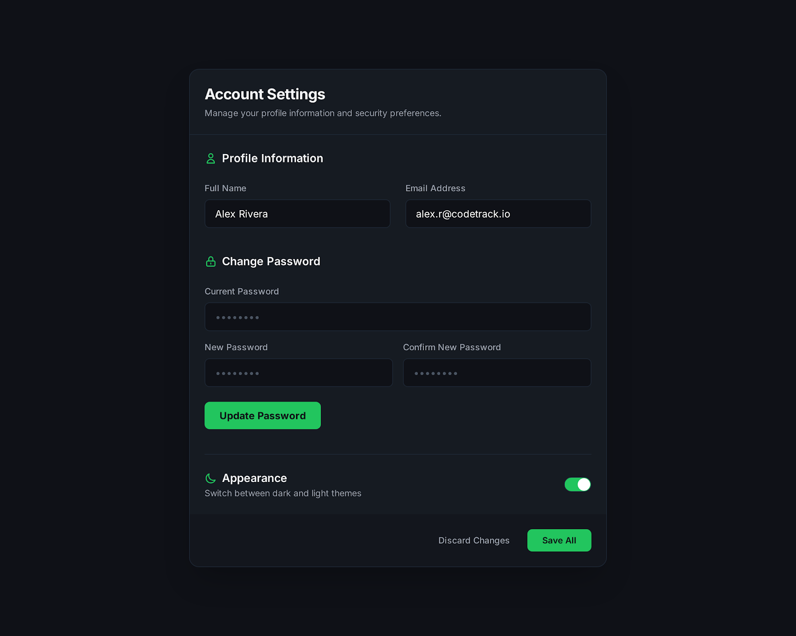

# Code Arena

**Track coding consistency. Build streaks. Stay accountable.**

Code Arena is a developer productivity workspace for logging study sessions, managing tasks, visualizing progress on a GitHub-style heatmap, and keeping persistent workspace notes — all in one dark-themed dashboard.

**Live app:** [codearena.diy](https://codearena.diy)

---

## Screenshots

### Dashboard
Session timer, yearly activity heatmap, workspace notes, and quick stats in one view.



### Login
Secure sign-in with forgot-password OTP flow.



### Tasks
Create, filter, and complete coding tasks with topic tags.



### Study history
Browse past sessions with date and topic filters.



### Settings
Profile, password change (OTP verified), and theme toggle.



---

## Why Code Arena?

Most developers guess how much they code. Code Arena replaces guesswork with data:

- **Consistency over perfection** — streaks and heatmaps reward showing up daily
- **Low friction** — start a session, jot notes, check off a task
- **Private by design** — your data, your dashboard, no social feed
- **Built for real use** — persistent timers, autosave notes, JWT auth with refresh tokens

---

## Features

### Authentication & security
- Email/password registration and login
- JWT access tokens (short-lived) + HttpOnly refresh cookies (long-lived)
- Silent token refresh and multi-tab session sync
- Forgot password via email OTP (Resend)
- Change password from settings with OTP verification
- Rate limiting on auth, OTP, and refresh routes
- Protected API routes with Bearer token middleware

### Dashboard
- Today’s study time and session count
- Current and longest streak
- Full-year contribution heatmap (GitHub-style, responsive)
- **Workspace notes** — markdown editor, autosave, tags, pin, session context
- Live session timer with topic tagging
- Active tasks preview panel

### Study sessions
- Start/stop session tracking with topic tags
- Timer survives page refresh (localStorage)
- Paginated study history with filters
- Daily stats and streak calculation
- Redis-cached heatmap and stats endpoints

### Task management
- Create tasks with optional descriptions
- Toggle completion, search, and pagination
- Filter by pending/completed status

### Developer experience
- Swagger UI at `/api-docs`
- Zod request validation
- Redis caching with graceful fallback
- CORS + Helmet security headers
- Vite dev proxy for zero-config local API calls

---

## Tech stack

| Layer | Technologies |
|-------|----------------|
| **Frontend** | React 19, React Router 7, Vite, Tailwind-style utility CSS |
| **Backend** | Node.js, Express 5, Mongoose |
| **Database** | MongoDB |
| **Cache** | Redis (optional) |
| **Auth** | JWT, bcrypt, HttpOnly cookies |
| **Email** | Resend |
| **Docs** | Swagger (OpenAPI) |

---

## Project structure

```
Code Arena/
├── backend/
│   ├── controllers/     # Route handlers
│   ├── models/          # Mongoose schemas
│   ├── routes/          # API routers
│   ├── middleware/      # Auth, validation
│   ├── config/          # DB, Redis, Swagger
│   └── utils/           # Helpers, email, errors
├── frontend/
│   ├── src/
│   │   ├── pages/       # Home, Dashboard, Tasks, History, Settings
│   │   ├── components/  # Navbar, Notes, Heatmap tooltip
│   │   ├── context/     # Auth provider
│   │   └── api/         # Fetch client + token refresh
│   └── public/
└── docs/screenshots/    # README images
```

---

## Getting started

### Prerequisites

- Node.js 18+
- MongoDB (local or Atlas)
- Redis (optional — app runs without it)
- Resend API key (for password OTP emails)

### 1. Clone and install

```bash
git clone https://github.com/dhruv1086k/CODE-ARENA.git
cd code-arena

cd backend && npm install
cd ../frontend && npm install
```

### 2. Backend environment

Create `backend/.env`:

```env
MONGODB_URI=mongodb+srv://<user>:<pass>@<cluster>/<db>
PORT=5000
NODE_ENV=development

ACCESS_TOKEN_SECRET_KEY=<long-random-string>
ACCESS_TOKEN_EXPIRY=15m
REFRESH_TOKEN_SECRET_KEY=<another-long-random-string>
REFRESH_TOKEN_EXPIRY=15d

FRONTEND_URLS=http://localhost:5173,https://codearena.diy

RESEND_API_KEY=<your-resend-key>
EMAIL_FROM=CodeArena <noreply@yourdomain.com>

REDIS_URL=redis://localhost:6379
```

### 3. Frontend environment

`frontend/.env.development` — leave empty or omit `VITE_API_BASE_URL` (Vite proxies `/api` to the backend).

`frontend/.env.production`:

```env
VITE_API_BASE_URL=https://your-backend.onrender.com
```

### 4. Run locally

```bash
# Terminal 1 — backend
cd backend
npm run dev

# Terminal 2 — frontend
cd frontend
npm run dev
```

| Service | URL |
|---------|-----|
| App | http://localhost:5173 |
| API | http://localhost:5000 |
| Swagger | http://localhost:5000/api-docs |

---

## Authentication overview

| Token | Lifetime (default) | Storage |
|-------|-------------------|---------|
| Access token | 15 minutes | `localStorage` + `Authorization` header |
| Refresh token | 15 days | HttpOnly cookie + MongoDB (revocation) |

On login/register, both tokens are issued. The access token is used for API calls; when it expires, the client refreshes silently using the cookie. Logout clears the cookie and invalidates the stored refresh token.

---

## API overview

| Method | Endpoint | Description |
|--------|----------|-------------|
| POST | `/api/v1/auth/register` | Create account |
| POST | `/api/v1/auth/login` | Sign in |
| GET | `/api/v1/auth/refresh` | Refresh access token |
| GET | `/api/v1/auth/logout` | Sign out |
| POST | `/api/v1/study-session/start` | Start session |
| POST | `/api/v1/study-session/stop` | Stop session |
| GET | `/api/v1/study-session/heatmap` | Yearly activity data |
| GET | `/api/v1/study-session/streak` | Streak stats |
| GET/PUT | `/api/v1/notes/workspace` | Load/save workspace notes |
| GET/POST | `/api/v1/todos` | List/create tasks |
| GET | `/api/v1/users/me` | Current user profile |

Full interactive docs: `/api-docs` when the backend is running.

---

## Deployment

| Part | Suggested host |
|------|----------------|
| Frontend | Vercel |
| Backend | Render / Railway |
| Database | MongoDB Atlas |
| Redis | Redis Cloud |
| Domain | Custom domain (e.g. codearena.diy) |

Production checklist:

1. Set `NODE_ENV=production` on the backend
2. Set `FRONTEND_URLS` to your exact frontend origin(s)
3. Set `VITE_API_BASE_URL` to your backend URL
4. Ensure refresh cookies work cross-origin (`Secure`, `SameSite=None`)

---

## Activity & streaks

Activity is derived automatically when you **complete a study session** or **mark a todo done**. The yearly heatmap aggregates session counts and study time per day. Streaks track consecutive days with recorded activity.

---

## Author

**Dhruv Pal**

Built as a personal productivity system for measuring coding consistency — not perfection.

---

## License

ISC
